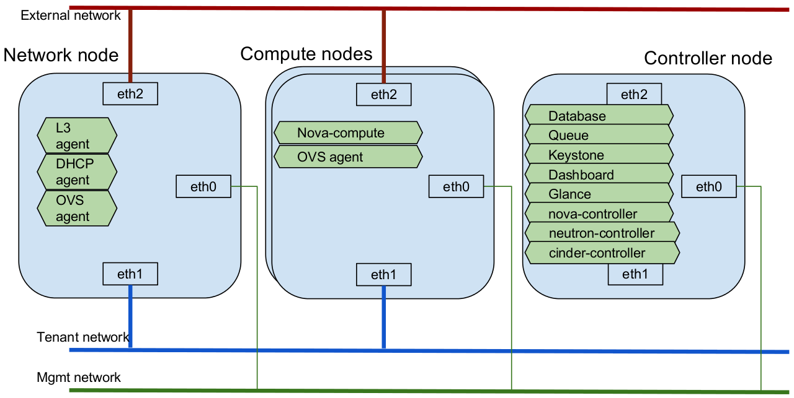
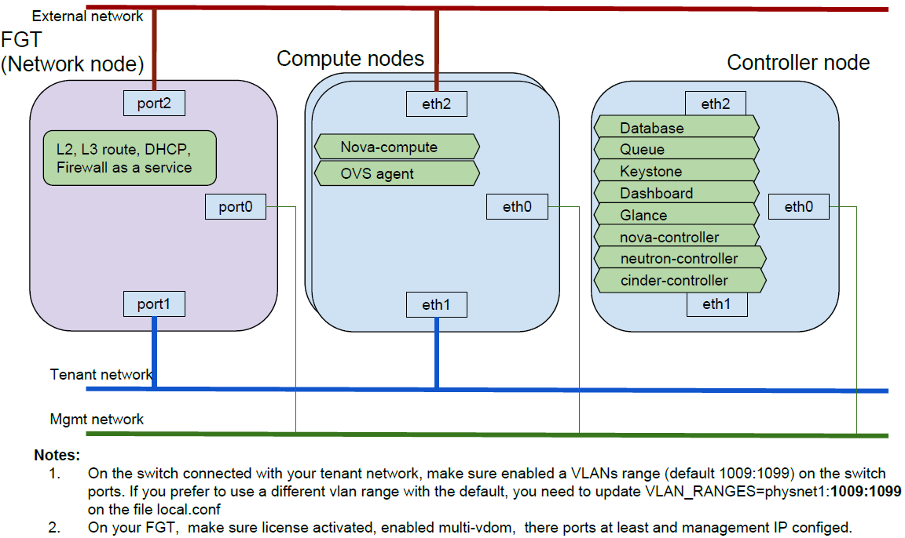

# Installation guide

This script will help you to install specific openstack roles to the machine,
before run the script, you need to update the environment variables in the 
local.conf file according to your setup.

Network layout:

    1. Standard Openstack network layout

    
    2. Openstack network layout with Fortigate 

Prerequisites:

    1. Supported host os: Centos 7 and up minimal installation.
       notes: disable related firewall functions after OS installation.
       e.g. CentOS-7-x86_64-Minimal-1511.iso
            (download link http://isoredirect.centos.org/centos/7/isos/x86_64/ )
       
       disable selinux (update /etc/selinux/config and restart os)
       disable firewalld (systemctl disable firewalld) 

    2. Three ethernet interfaces per host are required, these interfaces will 
       be used as below:
           one interface for Openstack management, default eth0
           one interface for tenant network (vm <-> vm), default eth1
           one interface for external network (vm <-> outside ), default eth2
       
       The management network nic and the tenant network nic should have
       an working static ipv4 address for each interface.
       If your environment is different with default, you can customize related
       variables in the file 'local.conf' according to your environment:
       e.g.
       the default:
           INTERFACE_MGMT=eth0
           INTERFACE_INT=eth1
           INTERFACE_EXT=eth2 
       updated:
           INTERFACE_MGMT=eno16777728
           INTERFACE_INT=eno33554952
           INTERFACE_EXT=eno50332176

    3. If run multi-nodes installation, you need to assign controller ip on
       the variable 'CTRL_MGMT_IP' in the file 'local.conf'
           CTRL_MGMT_IP=[default is host INTERFACE_MGMT ip]
           e.g. CTRL_MGMT_IP=10.160.37.60

    4. Execute the script as root

    5. Internet connection is required

Usage:
   
    git clone https://github.com/samsu/installation
    cd installation
    vi local.conf  # set related variables according to your environment
    ./ins.sh [-h] [-v openstack_releasename] rolenames

Options:

    -h  this help
    -v  assign an openstack version to be installed, currently supported
        Openstack version are: liberty, mitaka
        the default openstack version is 'mitaka'

Rolenames:
    The rolenames could be any one or combo of the follow role set.

    a) Openstack all-in-one installation role name list:
        allinone

    b) Openstack multi-nodes installation role name list:
        controller
        network
        compute

    c) Openstack component installation role name list:
        database
        mq
        dashboard
        keystone
        glance
        nova_ctrl
        nova_compute
        neutron_ctrl
        neutron_compute
        neutron_network
        cinder_ctrl

Examples:

    # Install all openstack stuff(allinone role) in one machine
    ./ins.sh -v mitaka allinone

    # Install two roles(nova controller and neutron controller) in a machine
    ./ins.sh nova_ctrl neutron_ctrl
    
    # Install Openstack with fortinet plugins
    a) Before run the script, a fortigate need to be initialized properly.
       1) license activated
       2) enabled multi-vdom
       3) At least there are 3 ports in the fortigate: a port for management
       need to have a ip address, a port for openstack tenant network and 
       a port for openstack external network. 
    
    b) Customize the local.conf file, the following is an example local.conf
       with enabled fortinet plugins
        ############## EXAMPLE local.conf #################
        # openstack config
        CTRL_MGMT_IP=10.160.37.80
        INTERFACE_MGMT=eth0
        INTERFACE_INT=eth1
        INTERFACE_EXT=eth2
        
        # ml2 network type drive, could be vlan, gre, vxlan.        
        TYPE_DR=vlan
        # All Vlanid in vlan ranges used by tenant networks need to be
        # pre-configured on all switches connected with tenant networks.
        VLAN_RANGES=physnet1:1000:1100
        
        # Enable fortinet plugin, when ENABLE_FORTINET_PLUGIN, TYPE_DR only 
        # support vlan
        ENABLE_FORTINET_PLUGIN=True
        FORTINET_ADDRESS=10.160.37.96
        FORTINET_EXT_INTERFACE=port9
        FORTINET_INT_INTERFACE=port1
        
        ###################################################

    c) Install Openstack controller on a host:
        ./ins.sh -v mitaka controller
       
    d) Install Openstack compute on other hosts:
        ./ins.sh -v mitaka compute

Notes:

     If you are doing multi-modes installation, the suggested script run sequence is: 
     1. prepare your fortigate (if have)
     2. Install controller
     3. Install others (compute/network)
